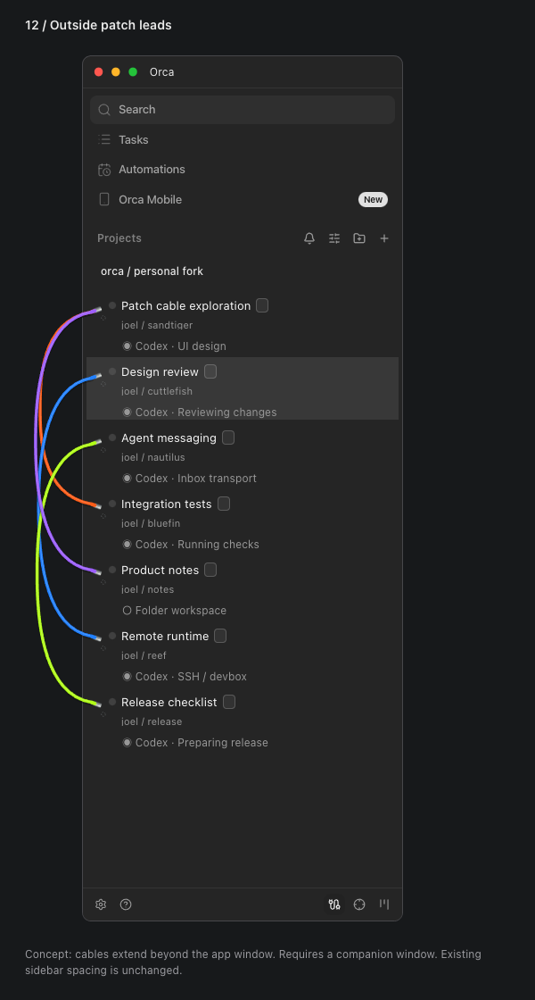
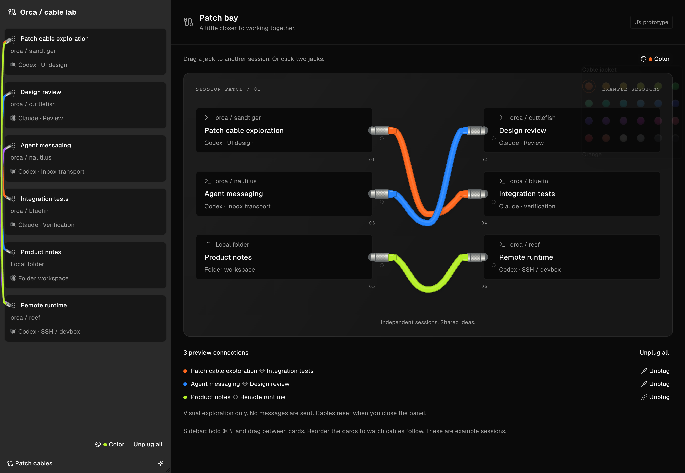
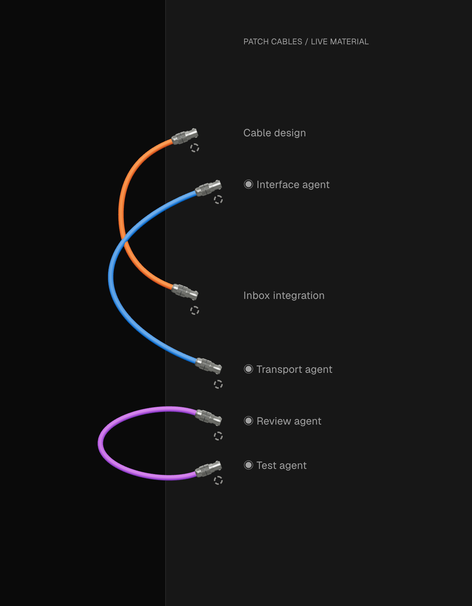

# Joel’s Orca

Personal experiments on top of [stablyai/orca](https://github.com/stablyai/orca), maintained in [joelthecoder/orca](https://github.com/joelthecoder/orca). These changes are for this fork; they are not upstream features or requests for upstream PRs.

## Patch cables

Connect session and workspace cards with chunky, brightly colored cables inspired by physical synth patch leads. Hold **Command + Option on macOS**, or **Ctrl + Alt on Windows/Linux**, and drag from one sidebar card to another. A translucent cable follows the pointer; dropping it on a card finishes the connection. **Escape** cancels. Ordinary dragging still reorders cards.

The cable button at the bottom of the **main Projects sidebar** reveals jacks and a color picker. You can also click two jacks to connect them, including with the keyboard. Choose from **24 cable jackets**, including purple, red, yellow, hot pink, cyan, black, graphite, silver, and white. Each endpoint accepts up to eight connections and shows a faint spare jack when another connection is available.





The first image is the selected layout study, using synthetic names and the existing sidebar components. The palette screenshot is from the standalone lab. The actual feature attaches to the main app's existing workspace and agent rows.



The live renderer uses Three.js tube geometry, machined-metal profiles, raised diamond grip facets, and physically lit rubber. The tube shares its connector's exit axis, avoiding a separate-looking joint. Geometry follows the endpoints and UI zoom; it redraws on change rather than continuously animating. An SVG fallback remains available if WebGL cannot initialize.

Each plug covers its recessed socket, leaving a narrow metal rim. A faint dashed spare port directly below a connected plug starts another connection when clicked; it disappears at eight connections. Agent sockets follow the indentation and vertical center of their own row; adjacent agents use outward-angled plugs so short cables form a rounded loop.

### Connect from an agent or terminal

The fork also exposes `orca patch list --json`, `orca patch connect --from <endpoint-or-handle> --to <endpoint-or-handle> --color purple --json`, and `orca patch disconnect --from <endpoint-or-handle> --to <endpoint-or-handle> --json`. Use the CLI for this desktop profile (`orca-dev` during development), with the main Projects sidebar open. Copy endpoint IDs or terminal handles from `patch list`; expand a workspace to expose its agent endpoints.

The CLI uses the same connection and inbox flow as dragging. Its `mail` receipt distinguishes `queued` introductions from `visual-only` cables. The version-matched `orca-cli` and `orchestration` guides document this workflow. Mainline builds do not have these commands.

### What works today

- Modifier-drag between sidebar cards, a ghost cable during the drag, and click/keyboard jack selection.
- Individual agent connections within one worktree or across worktrees and repositories, in both compact and expanded agent rows.
- Connections across repositories, worktrees, and folder workspaces. Host identity is part of each address, so identical paths or pane names on two hosts cannot collide.
- Cables reshape when rows move, the sidebar resizes, or UI zoom changes. They follow Orca’s existing card drag preview while reordering.
- Hiding patch mode retains the connections in the current renderer session. A virtualized or collapsed endpoint can temporarily hide its cable; remounting the endpoint restores the drawing without changing the connection.
- A palette of 24 centrally defined material tokens, with normal Orca controls and theme surfaces.

### Peer communication

Connecting two live agents verifies their mailbox identities and queues an introduction in **both existing Orca inboxes**. Each introduction names the peer, gives the send/check commands, and asks for useful updates about scope, contracts, blockers, decisions, and results. It explicitly discourages repeated acknowledgements and transcript forwarding. Existing orchestration delivery gates handle busy sessions and human approvals; queued mail is not a claim that an agent has read it.

A workspace with exactly one visible agent can resolve to that agent. For multiple agents, drag from a specific agent row. Empty workspaces remain visual connections. Local sessions and two sessions on the same paired runtime use their owning runtime. Cross-host and direct-SSH mail are not wired: the UI reports a visual-only connection rather than sending to a guessed local address. Provider-owned subagents without independent mailboxes are not separate endpoints.

**Unplug all** sends disconnect notices for introduced peers. A failed introduction or disconnect is surfaced. This first version keeps cable state in the renderer; a reload clears the drawing but does not recall messages already delivered to agents. Unplug before reloading if the peer relationship should end. Peer cooperation is instruction-based, not an automatic transcript mirror or permission to override the user's task.

The Agents activity view is not wired into patch mode yet. The jacks belong to workspace cards and their inline session rows in the Projects sidebar.

Cables hang outside the left edge using a transparent, non-focusable, click-through child window attached to the **main Orca window**. There is no separate user-facing screen to manage. Movement and resize events keep its bounds aligned with the main content; the host's zoom factor controls its scale. It hides with the main window and in native fullscreen. All automated launches keep it hidden. This has been checked on macOS; Windows/Linux compositor behavior still needs native validation. See [Electron’s window documentation](https://www.electronjs.org/docs/latest/api/browser-window).

## Run this fork

### Installed macOS app

Install dependencies with `pnpm install --frozen-lockfile` and `pnpm --dir mobile install --frozen-lockfile`. Then `pnpm build:local` builds a standalone **Orca Local.app** for the current Mac architecture under `dist/local/`. Copy that app to `/Applications/Orca Local.app` to install or replace this fork. Quit Orca Local before replacing it. The normal Orca app remains separate.

The installed fork uses bundle ID `com.joelthecoder.orca.local` and profile `~/Library/Application Support/orca-local`. It does not import the mainline or development profile. Its upstream updater is disabled; rebuild and replace the app to pick up source changes. This is a local build without Apple notarization. Packaging retains Orca’s native dependency and bundled resource checks.

### Development

Use the normal project prerequisites and host-native dependencies:

```sh
pnpm install
pnpm build:cli
pnpm dev:fork
```

`dev:fork` reuses Orca’s development build/launch pipeline and names the app **Orca — Joel**. It rebuilds source changes and uses a separate `orca-joel` profile under the platform’s application configuration directory. Add your repositories to that profile once. It does not copy credentials, conversations, or databases out of your existing Orca installation.

The development runtime skips the packaged updater, so an upstream release cannot replace this running fork. Quit this fork instance and run `pnpm dev:fork` again after updating dependencies or main-process code. Renderer edits normally reload during development. The installed mainline app remains available separately.

Agent-launched validation must use `ORCA_BACKGROUND_LAUNCH=1`; test windows remain hidden. Run the command above yourself for a visible everyday instance. This is a source/development workflow, not a signed packaged release.

For the standalone visual lab:

```sh
pnpm dev:patch-cables
```

This opens `http://127.0.0.1:5199/patch-bay-preview.html`. It needs no agents or credentials and supports card reordering, cable colors, and theme switching. The lab HTML is not an entry point in production packaging.

## Keep upstream current

This working copy already has two remotes:

| Remote                       | Purpose                  |
| ---------------------------- | ------------------------ |
| `origin` → `stablyai/orca`   | Read upstream updates    |
| `fork` → `joelthecoder/orca` | Publish personal changes |

They are intentionally not renamed: Git remote configuration is shared with the other Orca worktrees. In a fresh clone, `origin` can point to Joel’s fork and `upstream` to the original repository. The URL, not the nickname, decides which is safe to push to.

The personal branch for this experiment is `joelthecoder/joel-inter-agent-messaging`. Keep upstream’s main branch separate. In a clean checkout of the personal branch, fetch the two named branches, merge upstream, run the checks, and push only to the fork:

```sh
git fetch origin main
git fetch fork joelthecoder/joel-inter-agent-messaging
git merge --no-edit origin/main
pnpm install
pnpm tc:web
pnpm run check:code-quality:changed
pnpm tc:node
ORCA_BACKGROUND_LAUNCH=1 pnpm test src/renderer/src/components/patch-bay src/main/runtime/rpc/methods/orchestration/messaging/patch-peer-mail.test.ts
ORCA_BACKGROUND_LAUNCH=1 pnpm run test:e2e tests/e2e/patch-cables.spec.ts --workers=1
git push fork HEAD:refs/heads/joelthecoder/joel-inter-agent-messaging
```

Resolve conflicts deliberately and rerun checks. Keep merge commits rather than rewriting published personal history. Never force-push upstream or open a PR against the original project as part of this workflow.

The [Codex-only upstream maintenance prompt](docs/fork/upstream-sync.md) specifies isolated candidates, verification, and the boundary between preparing an update and publishing it. Updating source must not silently restart a running app with live sessions.

## Change log and evidence

| Date       | Personal change                                                                                                                              | Verification                                                                                                                |
| ---------- | -------------------------------------------------------------------------------------------------------------------------------------------- | --------------------------------------------------------------------------------------------------------------------------- |
| 2026-09-25 | Main-sidebar patch cables, 24 colors, 3D material rendering, outside-window companion, agent inbox introductions, and separate fork launcher | Hidden Electron cross-repo drag/ghost/zoom/unplug check; peer-mail routing and real inbox tests; identity and reorder tests |

For every future personal feature, update this file with behavior, limitations, verification, and fresh screenshots. Keep captures on synthetic fixtures so shared documentation does not expose private repository names, conversations, or credentials.
